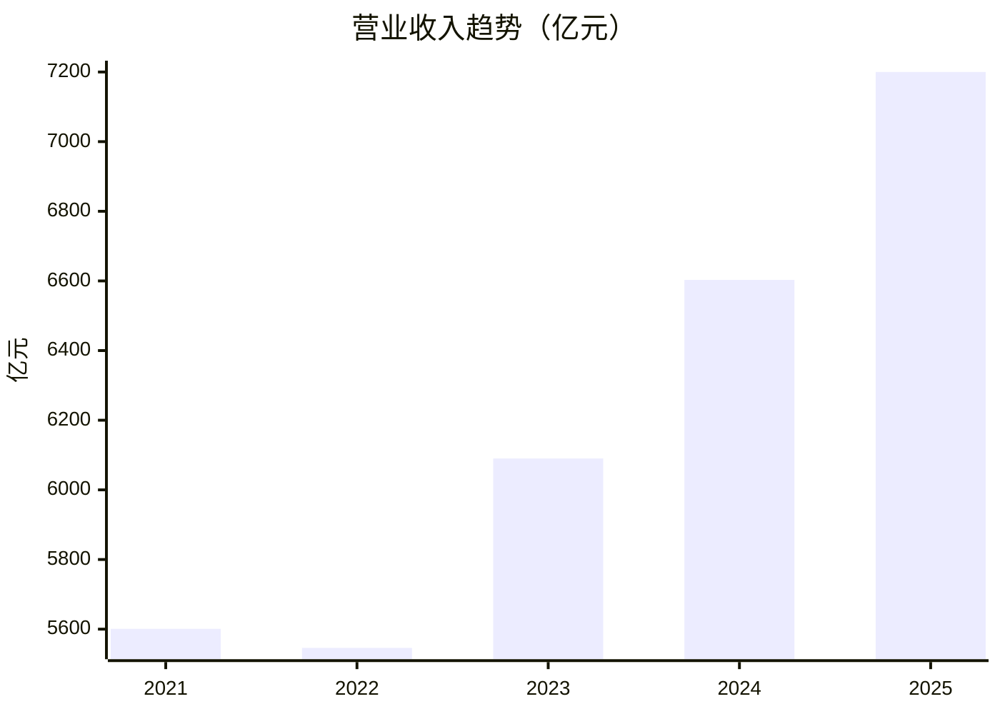
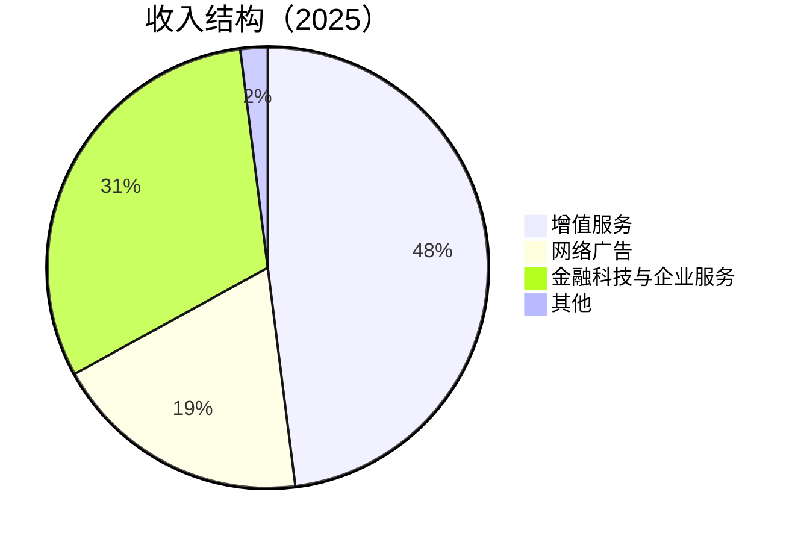
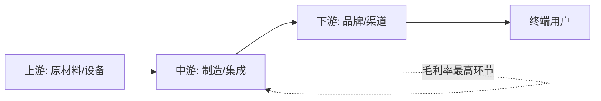
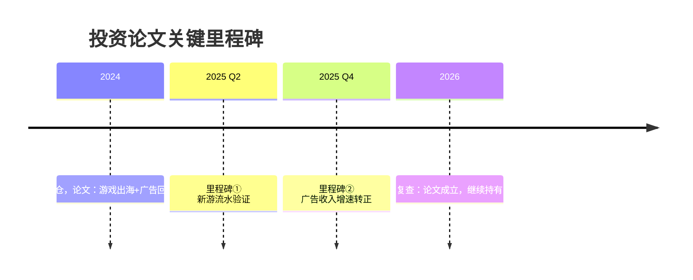
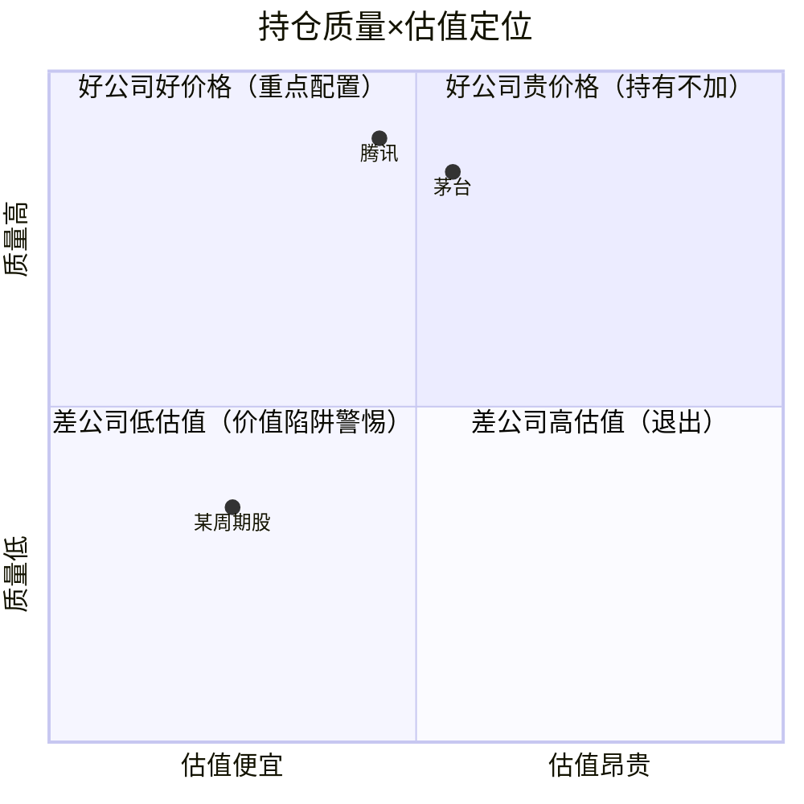

```mermaid
xychart-beta
    title "毛利率对比：公司A vs 公司B（%，前为A后为B）"
    x-axis [2023, 2024, 2025]
    y-axis "%"
    bar [42.1, 43.5, 45.0]
    bar [35.2, 34.8, 33.9]
```

# 报告可视化规范（全系统唯一权威定义）

> 所有子流程输出报告中的图表均遵循本规范；各子流程 SKILL.md 中的图表要求与本文件冲突时，以本文件为准。
> 核心原则：**图为辅、表为准**——每张图必须紧跟对应的数据表格，数据抽检器（`tools/report_audit.py`）只认表格，图中数字不作为核验对象。

## 图表生成三级方案（从上到下依次尝试）

| 级别 | 方案 | 适用条件 | 效果 |
|------|------|---------|------|
| 首选 | **`tools/chart_gen.py` 生成 PNG**（matplotlib） | 环境具备 Bash+Python3，且工具退出码为 0 | 出版级，中文/配色/数值标注完整 |
| 降级一 | Mermaid 代码块 | chart_gen 退出码 1（matplotlib 缺失/损坏）或无 Python 环境 | 一般，依赖渲染器支持 |
| 降级二 | 符号/表格方案 | 渲染环境不支持对应 Mermaid 语法 | 保底，信息不丢失 |

**chart_gen 使用约定**：
- PNG 统一输出到报告同目录的 `charts/` 子目录（如 `reports/腾讯/charts/revenue-trend-20260720.png`），Markdown 以相对路径引用 ``；
- 权威调用语法见 [`skills/financial-data/references/verification-playbook.md`](../skills/financial-data/references/verification-playbook.md)；退出码：0=成功 / 1=matplotlib 不可用（按上表降级，不算失败） / 2=参数错误；
- 类型3 链路图与类型6 时间线 chart_gen 不覆盖，首选即 Mermaid（它们是 Mermaid 的强项）。

## 总原则

1. 每张图必须配套 Markdown 数据表格（图紧跟表之后），表格是唯一数据权威——PNG 图同样适用；
2. 单份报告图表控制在 3-6 张，只给关键信息配图，不为配图而配图；
3. 同一份报告内不混用方案级别（能出 PNG 就全部 PNG，降级也整体降级），链路图/时间线例外；
4. 降级发生不影响报告结论，无需向用户道歉，报告末尾注一句即可。

## 七类图表标准

### 1. 趋势类（营收/利润/现金流 3-5 年走势）

**首选**（chart_gen PNG）：

```bash
python3 tools/chart_gen.py trend --title "营业收入趋势（亿元）" \
  --x '[2021,2022,2023,2024,2025]' --series '{"营收":[5601,5546,6090,6603,7200]}' \
  --ylabel 亿元 --output reports/{公司名}/charts/revenue-trend-{日期}.png
```

多系列（营收+净利润同图）在 `--series` 中传多个键；折线风格加 `--kind line`。

**降级一**（Mermaid `xychart-beta`）：

````markdown

````

**降级二**（渲染环境不支持 xychart-beta 时）：数据表格增加趋势符号列，`▲` 上升 / `▼` 下降 / `→` 持平（±2% 以内）：

| 年份 | 营收（亿元） | 同比 | 趋势 |
|------|------------|------|------|
| 2024 | 6,603 | +8.4% | ▲ |
| 2025 | 7,200 | +9.0% | ▲ |

### 2. 结构类（收入结构/持仓占比/分部利润）

**首选**（chart_gen PNG）：

```bash
python3 tools/chart_gen.py structure --title "收入结构（2025）" \
  --values '{"增值服务":48,"网络广告":19,"金融科技与企业服务":31,"其他":2}' \
  --output reports/{公司名}/charts/revenue-structure-{日期}.png
```

**降级一**（Mermaid `pie`）：

````markdown

````

**降级二**：占比表格 + 文本条形（`█` 每格约 5%）：

| 分部 | 占比 | 图示 |
|------|------|------|
| 增值服务 | 48% | █████████▌ |
| 金融科技与企业服务 | 31% | ██████ |

### 3. 链路类（产业链全景/商业飞轮/上下游价值分配）

**首选即 Mermaid `flowchart LR`**（拓扑图是 Mermaid 强项，chart_gen 不覆盖本类）：

````markdown

````

**降级方案**：代码块内文本箭头图（`上游 → 中游 → 下游`，逐层缩进标注要点）。

### 4. 评分类（四维评分/Checklist 通过率）

统一 **五星制** `★★★★☆`（半星用 `☆` 省略，只保留整星粒度），直接放在表格列中，不单独作图：

| 维度 | 评分 | 核心判断 |
|------|------|---------|
| 生意质量 | ★★★★☆ | 护城河清晰但增速放缓 |
| 管理层 | ★★★★★ | 资本配置纪律优秀 |

### 5. 对比类（公司 vs 同业关键指标）

**首选**（chart_gen PNG，分组柱状自动配色+图例，支持 ≥3 家对比）：

```bash
python3 tools/chart_gen.py compare --title "毛利率对比（%）" \
  --x '[2023,2024,2025]' --series '{"公司A":[42.1,43.5,45.0],"公司B":[35.2,34.8,33.9]}' \
  --ylabel "%" --output reports/{公司名}/charts/margin-compare-{日期}.png
```

**降级一**（Mermaid `xychart-beta` 多系列，同一坐标系内并列多组 bar/line，图题中标明系列顺序；仅适合 2 家对比）：

````markdown

````

**降级二**（或 Mermaid 对比公司 >2 家时直接用）：并列对比表格，最优值加粗：

| 指标（2025） | 公司A | 公司B | 公司C |
|------|------|------|------|
| 毛利率 | **45.0%** | 33.9% | 28.1% |
| ROE | **32.5%** | 18.2% | 15.7% |

### 6. 时间线类（公司大事记/投资论文里程碑）

**首选即 Mermaid `timeline`**（chart_gen 不覆盖本类）：

````markdown

````

**降级方案**：编号列表（`1. 时间 — 事件 — 影响`），按时间升序。

### 7. 象限类（组合持仓的质量×估值定位）

**首选**（chart_gen PNG，散点+四象限分区，坐标 0-1）：

```bash
python3 tools/chart_gen.py quadrant --title "持仓质量×估值定位" \
  --points '{"腾讯":[0.45,0.9],"茅台":[0.55,0.85],"某周期股":[0.25,0.35]}' \
  --output reports/{公司名或主题}/charts/quadrant-{日期}.png
```

**降级一**（Mermaid `quadrantChart`，x 轴估值从便宜到贵，y 轴质量从低到高，坐标取值 0-1）：

````markdown

````

**降级二**：二维定位表（质量评级 × 估值分档）：

| 持仓 | 质量（五星制） | 估值分档 | 象限结论 |
|------|------|------|------|
| 腾讯 | ★★★★★ | 合理偏低 | 好公司好价格 |
| 某周期股 | ★★☆☆☆ | 低估 | 价值陷阱警惕 |

## 使用位置约定

| 报告类型 | 必配图表 | 参考模板位置 |
|---------|---------|-------------|
| 个股研究（investment-research / investment-team） | 3-5 年营收利润趋势图（类型1）+ 收入结构图（类型2）；有同业对标时加对比图（类型5） | 「核心数据速览」节 |
| 财报精读（earnings-review / earnings-team） | 关键指标趋势图（类型1）；与同业比较时加对比图（类型5） | 关键指标趋势节 |
| 行业研究（industry-research / industry-funnel） | 产业链全景图（类型3） | 产业链分析节 |
| 组合检视（portfolio-review） | 持仓占比图（类型2）+ 质量×估值象限图（类型7） | 组合结构节 |
| 论文跟踪（thesis-tracker / thesis-drift） | 论文里程碑时间线（类型6） | 里程碑盘点节 |
| 管理层研究（management-deep-dive） | 任期关键决策时间线（类型6） | 资本配置往绩节 |
| 各类评分表 | 五星制（类型4） | 评分总表 |

## 数据一致性要求

- 图中数值（含 PNG 图）必须与紧邻表格完全一致，数据来源标注在表格（不在图中重复标注）；
- 图表数据同样遵循 `skills/financial-data/SKILL.md` 双源验证规范——先验证、后作图；
- 修改报告数据时必须同步重新生成对应图表（PNG 重跑 chart_gen 命令即可），抽检打回修正后同理；
- PNG 与报告同在 `reports/` 下，移动报告时须连同 `charts/` 目录一起移动，否则图片引用失效。
